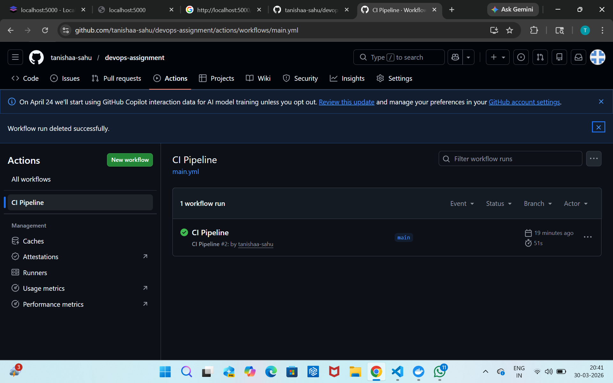
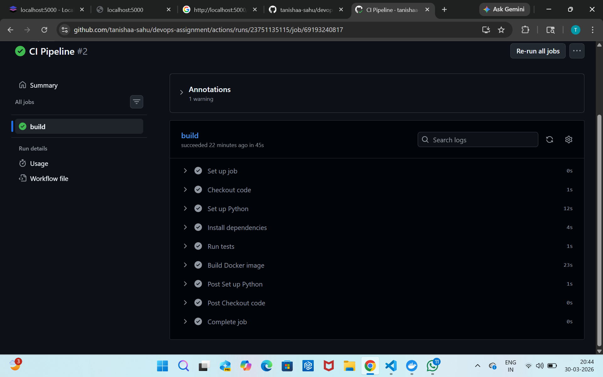
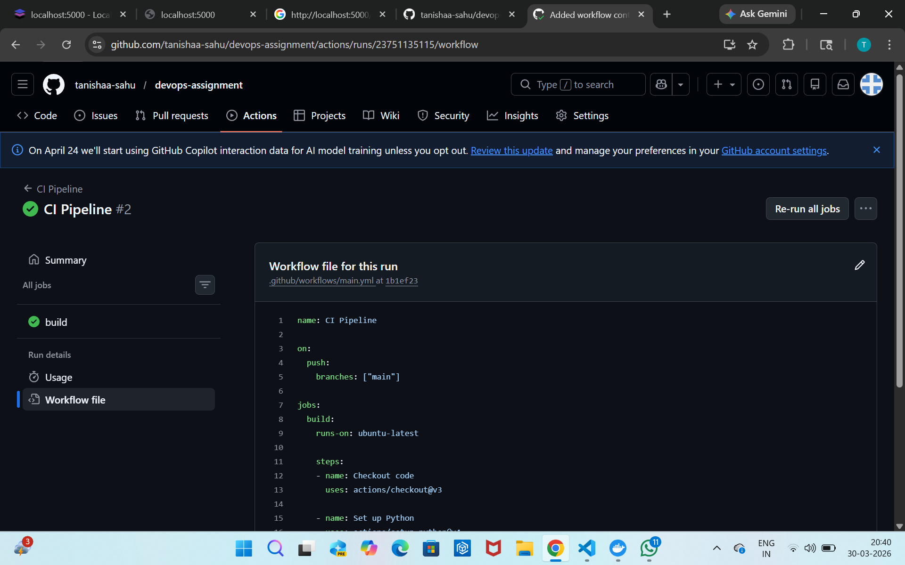
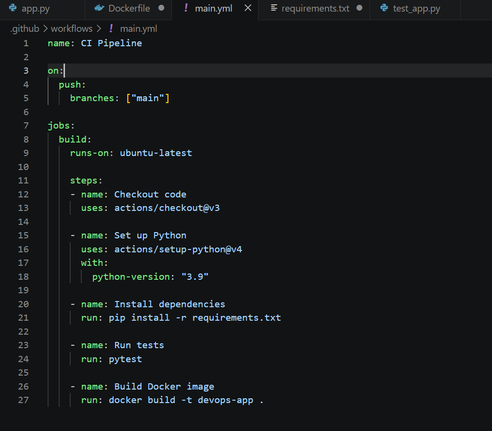
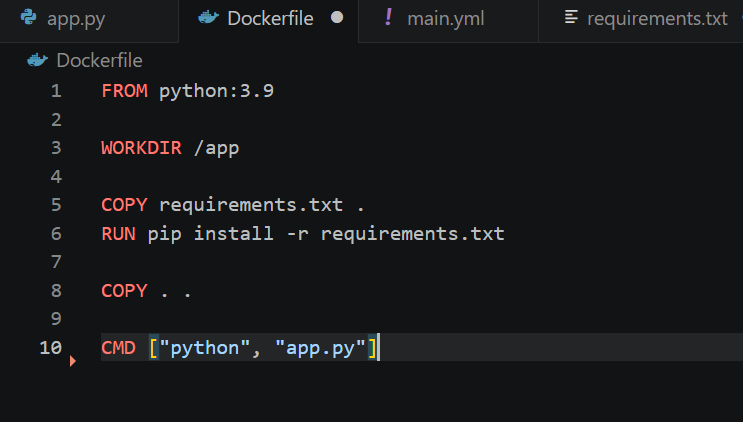
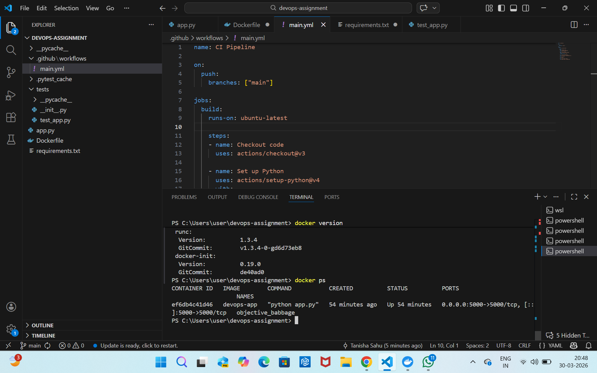
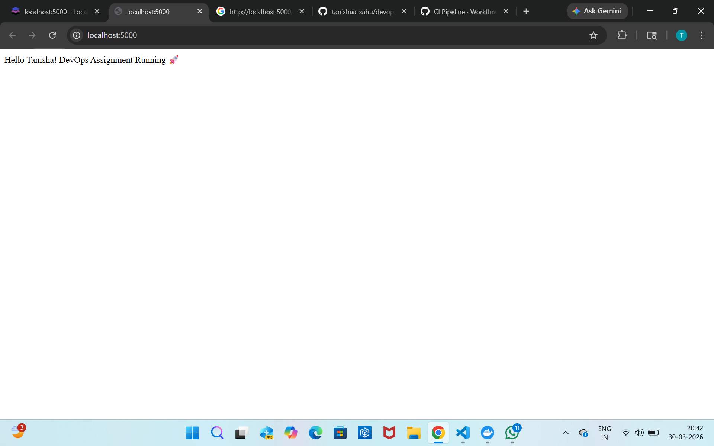
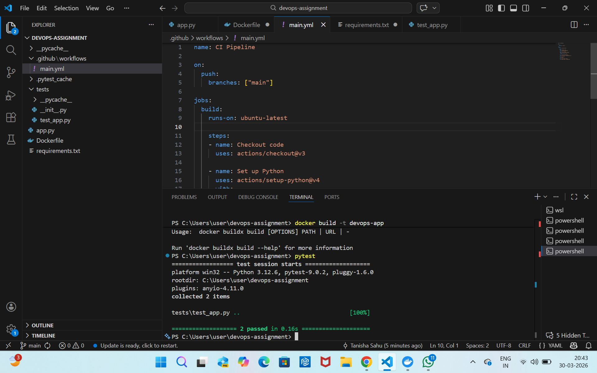
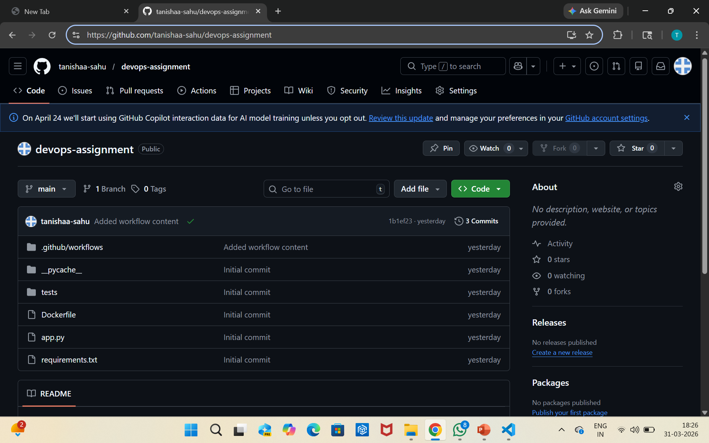

# 🚀 DevOps CI/CD Pipeline Project

## 📌 Project Description
This project demonstrates the implementation of a CI/CD pipeline using GitHub Actions and Docker. A simple Python web application is developed, tested, containerized, and automatically built using a CI pipeline.

---

## ⚙️ Technologies Used
- Python
- Docker
- GitHub Actions
- Pytest

---

## 🚀 Steps Performed

1. Created a simple Python web application (`app.py`)
2. Added test cases using Pytest (`test_app.py`)
3. Created a `requirements.txt` file
4. Wrote a Dockerfile to containerize the application
5. Built Docker image using:
   ```bash
   docker build -t devops-app .
   ```
6. Ran the Docker container:
   ```bash
   docker run -p 5000:5000 devops-app
   ```
7. Created CI pipeline using GitHub Actions (`.github/workflows/main.yml`)
8. Pushed code to GitHub repository
9. Verified successful pipeline execution (green tick)

---

## 🧪 Test Results

All test cases passed successfully using Pytest.

Example output:
```
2 passed in 0.16s
```

---

## 🐳 Docker Commands

### Build Docker Image:
```bash
docker build -t devops-app .
```

### Run Docker Container:
```bash
docker run -p 5000:5000 devops-app
```

---

## 🌐 Application Output

The application runs on:
```
http://localhost:5000
```

Output:
```
Hello Tanisha! DevOps Assignment Running 🚀
```

---

## ⚙️ CI/CD Pipeline

The pipeline is configured using GitHub Actions and performs the following steps:

- Checkout code
- Set up Python
- Install dependencies
- Run tests using Pytest

Workflow file: `.github/workflows/main.yml`

---

## 📸 Screenshots

### GitHub Actions Pipeline Success


### Workflow Steps Execution


### Workflow File Configuration


### Main CI/CD Pipeline Configuration


### Docker Dockerfile


### Docker Running in Terminal


### Application Output in Browser


### Tests Running (Pytest Results)


### GitHub Repository


---

## ✅ Conclusion

Successfully implemented a complete CI/CD pipeline using GitHub Actions and Docker. The project demonstrates automated testing and containerized deployment of a Python application.
